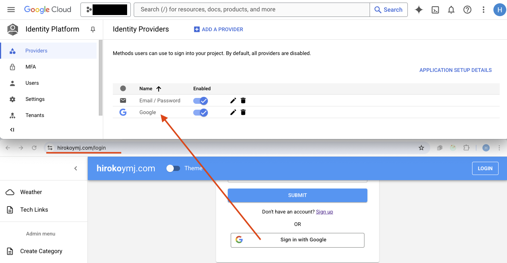

# hirokoymj.com

- Live URL : https://www.hirokoymj.com

## Technologies

**Frontend**

- JavaScript
- React.js (version 17)
- React Hooks, React Context
- React Router v6
- Redux Toolkit
- Apollo Client v3
- Google Map API
- Firebase Authentication for Google
- React Hook Form

**Backend** - https://github.com/hirokoymj/hiroko-web-backend-new

- Typescript
- Node.js
- Apollo Server v3
- Mongoose
- Weather API

**Database**

- MongoDB

## Google Cloud Platform(GCP)



<hr />


## References

- https://redux.js.org/introduction/getting-started
- https://fir-ui-demo-84a6c.firebaseapp.com/
- https://github.com/firebase/firebaseui-web
- https://firebase.google.com/docs/reference/js
- https://react-hook-form.com/
- https://github.com/jquense/yup
- https://firebase.google.com/docs/auth/web/google-signin
- https://reactrouter.com/home
- https://react.dev/reference/react/createContext
- https://mui.com/material-ui/getting-started/
- https://devcenter.heroku.com/articles/heroku-cli

## Deploy app on Heroku

```js
git heroku login
git push heroku master

git remote -v
heroku  https://git.heroku.com/hiroko-web-frontend.git (fetch)
heroku  https://git.heroku.com/hiroko-web-frontend.git (push)
```
